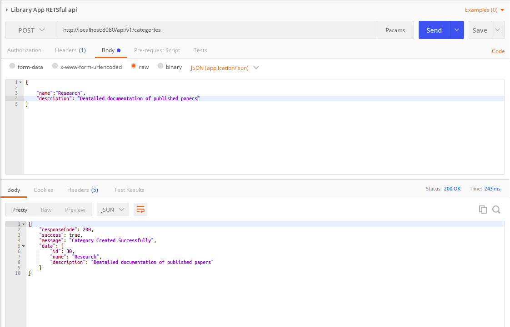
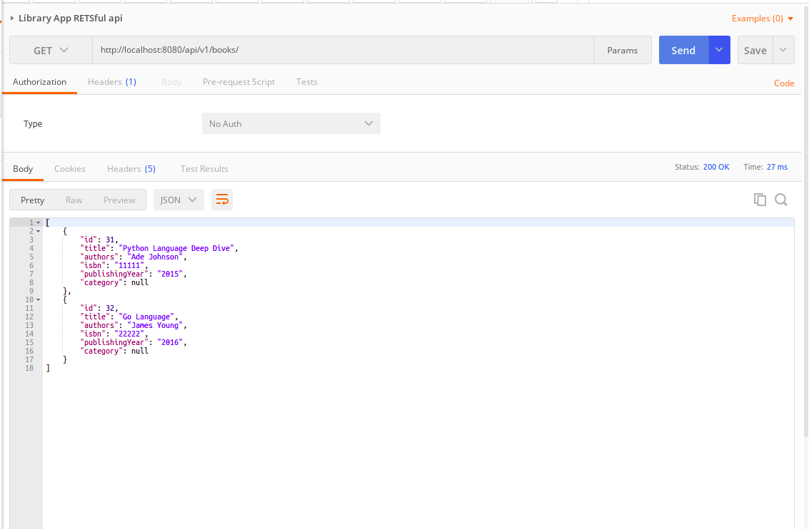

# LibraryApp
RESTful API for a library management application
* A RESTful API for a Library Management Application
* The resources includes Book and Category

## Features
* Add a category
* List Categories
* Add a Book
* List Books
* Edit details of a Book
* Add books to a category
* Delete a book

## Setup Configuration
* Create a new database with the name 'libraryappdb' in your local MySql. 
* You may update the database name, username, and password in the file application via 'application.properties' in the resources folder. 
* Run application locally and ensure succesful connection to the local mysql db

### Action: Add a category
* Adding a category named Programming Languages

---

* Adding a category named Software Architecture

---

* Adding a category named Fiction

---

* Adding a category named Networking

---

* Adding a category named Research

---

### Action: Display all categories
* Displaying all available categories

---

### Action: Add a book
* Adding a book titled Python Language

---

* Adding a book titled Go Language

---

* Adding a book titled Java Language

---

### Action: Display all books
* Displaying all available books

---

### Action: Display a specific book
* Displaying a specific book titled Python Language

---
* Displaying a specific book titled Go Language

---

### Action: Edit a specific book
* Make changes to the details of a specific book titled Python Languages

---

### Action: Display all books 
* Displaying all available books with changes made

---

### Action: Delete a book
* Delete a book titled Java Languages

---

### Action: Display all books 
* Displaying all available books with changes made

---

### Action: Add a book to a category
* Adding a book titled Python Language Deep Dive to a category named Programming Languages

---

### Action: Display all books 
* Displaying all available books with changes made

---

## Used
* Spring Boot
* Spring Data JPA
* Maven
* Mysql
* Mysql Workbench
* Postman

